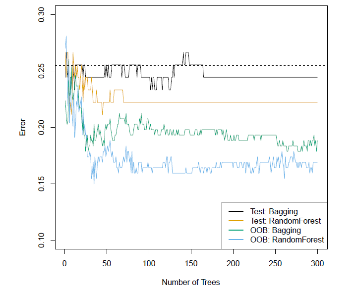

```{r setup, echo = FALSE}
knitr::opts_chunk$set(
  message = FALSE,
  fig.width = 10,
  fig.height = 4,
  comment = "#>",
  collapse = TRUE,
  warning = FALSE
)
```


        
        


# Ensemble methods - Random Forests 

## What are ensemble methods in tree based modeling ?

__en-sem-ble__

A unit or group of complementary parts that contribute to a single effect, especially:

 * A coordinated outfit or costume.

 * A coordinated set of furniture.

 * A group of musicians, singers, dancers, or actors who perform together

## Bootstrapping

<div align="center">
   
</div>


## What is bagging? how does it work?

  1.  __Create multiple data sets through bootstrapping:__

    Sampling is done with replacement on the original data and new datasets are formed.
    The new data sets can have a fraction of the columns as well as rows, which are generally hyper-parameters in a bagging model
    Taking row and column fractions less than 1 helps in making robust models, less prone to overfitting

  2. __Build multiple classifiers:__

    Classifiers are built on each data set.
    Generally the same classifier is modeled on each data set and predictions are made.

  3. __Combine classifiers:__

    The predictions of all the classifiers are combined using a mean, median or mode value depending on the problem at hand. The combined values are generally more robust than a single model.


## What is bagging? how does it work?


<div align="center">
   
</div>

## Bagging the heart data

<div align="center">
   
</div>

## Out-of-Bag error estimation

* It turns out that there is a very straightforward way to estimate the test error of a bagged model.

* Recall that the key to bagging is that trees are repeatedly fit to bootstrapped subsets of the observations. One can
show that on average, each bagged tree makes use of around two-thirds of the observations.

* The remaining one-third of the observations not used to fit a given bagged tree are referred to as the out-of-bag (OOB) observations.

* We can predict the response for the _ith_ observation using each of the trees in which that observation was OOB. This will yield around $B/3$ predictions for the _ith_ observation, which we average.

* This estimate is essentially the LOO cross-validation error for bagging, if $B$ is large.


## What is Random Forest ? How does it work?

  1. Assume number of cases in the training set is $N$. Then, sample of these $N$ cases is taken at random but with replacement. This sample will be the training set for growing the tree.

  2. If there are $M$ input variables, a number $m<M$ is specified such that at each node, $m$ variables are selected at random out of the $M$. The best split on these $m$ is used to split the node. The value of $m$ is held constant while we grow the forest.
  
  3. Each tree is grown to the largest extent possible and there is no pruning.
  Predict new data by aggregating the predictions of the ntree trees (i.e., majority votes for classification, average for regression).


## What is Random Forest ? How does it work?


<div align="center">
   
</div>


## Advantages of Random Forest


1. Random forest can solve both type of problems i.e. classification and regression and does a decent estimation at both fronts.

2. Random forest  can handle large data set with higher dimensionality. Further, RF models output Importance of variable, which can be a very usefull feature (on some random data set).

3. Computation of the out-of-bag error estimate removes the need for a set aside test set.


## References 

[An Introduction to Recursive Partitioning Using the rpart Routines](http://bit.ly/2oQiao8) - Details of the rpart package.
rpart.plot Package - Detailed manual on plotting with rpart using the rpart.plot package.

# Thank you!

* Slides:  <http://bit.ly/2q9NPSU>
* GitHub:  <https://github.com/trefoil-ml>
* Twitter: <https://twitter.com/trefoilML>
* Email:   info@tridata.nl  or hzmarrou@gmail.com

